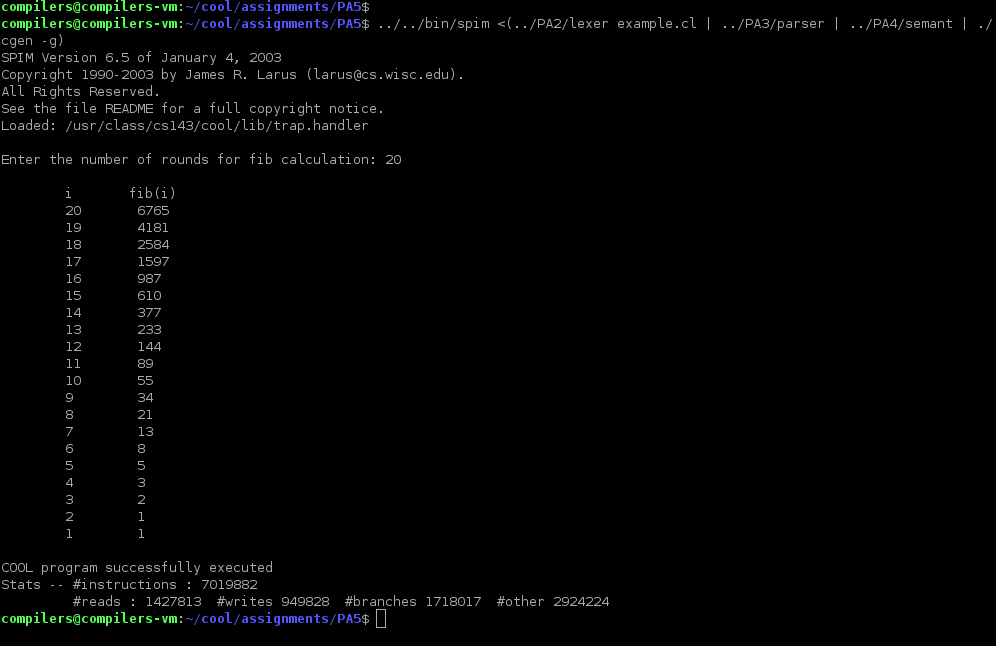

# CS143 note

Becaue of some reasons, i never took a compiler course in my university at CUHK(SZ) which was quite a pity for me. thus i decided to find and study some online courses from other universities. after searching, i found so many people strongly recommending to take the CS143 from Stanford University and that's why i chose it.

If you find my repo helpful, plz give me a star👍!

## course website

https://web.stanford.edu/class/cs143/

## online lectures

I took the online courses on [edx](https://courses.edx.org/) where offer free learning resources and quizzes.
Notice that I still got serveral weeks of online courses to watch. I would upload my notes once finished.

## labs

I finish all four labs including lexer (PA2), parser(PA3), semantic analyzor(PA4) and code generator(PA5). (PA short for programming assignment).
And all source codes were put in the `/assignments` folder.
My program would work properly with valid input code and would prompt error message of the erroneous input code.
I finish these labs quite in hurry👨‍💻, so i may be failed to find out some hidding bugs of my codes😂.
**If you find any bugs, plz let me know or help me corret them, thx a lot🙏!**

Here is a small demo of a valid input program which show how each component of my assignments works:
**all code line instructions put in the small label were run on the folder of `assignments/PA5`**

### source COOL code (`example.cl`)
```
(*  Example cool program testing as many aspects of the code generator
    as possible.
 *)
class Fib {
  fib(x : Int) : Int {
    if(x=1) then
      { 1; }
    else {
      if(x=2) then
        { 1; }
      else
        { fib(x-1)+fib(x-2); }
      fi; }
    fi
  };
};

class Main {
  fib_num : Int;
  fib : Fib <- new Fib;
  main():Int {
    {
      let io : IO <- (new IO) in
        {
          io.out_string("\nEnter the number of rounds for fib calculation: ");
          fib_num<-io.in_int();
          io.out_string("\n\ti\tfib(i)\n");
          while (not (fib_num=0)) loop {
            io.out_string("\t");
            io.out_int(fib_num);
            io.out_string("\t ");
            io.out_int(fib.fib(fib_num));
            io.out_string("\n");
            fib_num<-(fib_num-1);
          } pool;
          io.out_string("\n");
        };
      1; 
    }
  };
};

```

### result of lexer (`../PA2/lexer example.cl`)
```
#name "example.cl"
#5 CLASS
#5 TYPEID Fib
#5 '{'
#6 OBJECTID fib
#6 '('
#6 OBJECTID x
#6 ':'
#6 TYPEID Int
#6 ')'
#6 ':'
#6 TYPEID Int
#6 '{'
#7 IF
#7 '('
#7 OBJECTID x
#7 '='
#7 INT_CONST 1
#7 ')'
#7 THEN
#8 '{'
#8 INT_CONST 1
#8 ';'
#8 '}'
#9 ELSE
#9 '{'
#10 IF
#10 '('
#10 OBJECTID x
#10 '='
#10 INT_CONST 2
#10 ')'
#10 THEN
#11 '{'
#11 INT_CONST 1
#11 ';'
#11 '}'
#12 ELSE
#13 '{'
#13 OBJECTID fib
#13 '('
#13 OBJECTID x
#13 '-'
#13 INT_CONST 1
#13 ')'
#13 '+'
#13 OBJECTID fib
#13 '('
#13 OBJECTID x
#13 '-'
#13 INT_CONST 2
#13 ')'
#13 ';'
#13 '}'
#14 FI
#14 ';'
#14 '}'
#15 FI
#16 '}'
#16 ';'
#17 '}'
#17 ';'
#19 CLASS
#19 TYPEID Main
#19 '{'
#20 OBJECTID fib_num
#20 ':'
#20 TYPEID Int
#20 ';'
#21 OBJECTID fib
#21 ':'
#21 TYPEID Fib
#21 ASSIGN
#21 NEW
#21 TYPEID Fib
#21 ';'
#22 OBJECTID main
#22 '('
#22 ')'
#22 ':'
#22 TYPEID Int
#22 '{'
#23 '{'
#24 LET
#24 OBJECTID io
#24 ':'
#24 TYPEID IO
#24 ASSIGN
#24 '('
#24 NEW
#24 TYPEID IO
#24 ')'
#24 IN
#25 '{'
#26 OBJECTID io
#26 '.'
#26 OBJECTID out_string
#26 '('
#26 STR_CONST "\nEnter the number of rounds for fib calculation: "
#26 ')'
#26 ';'
#27 OBJECTID fib_num
#27 ASSIGN
#27 OBJECTID io
#27 '.'
#27 OBJECTID in_int
#27 '('
#27 ')'
#27 ';'
#28 OBJECTID io
#28 '.'
#28 OBJECTID out_string
#28 '('
#28 STR_CONST "\n\ti\tfib(i)\n"
#28 ')'
#28 ';'
#29 WHILE
#29 '('
#29 NOT
#29 '('
#29 OBJECTID fib_num
#29 '='
#29 INT_CONST 0
#29 ')'
#29 ')'
#29 LOOP
#29 '{'
#30 OBJECTID io
#30 '.'
#30 OBJECTID out_string
#30 '('
#30 STR_CONST "\t"
#30 ')'
#30 ';'
#31 OBJECTID io
#31 '.'
#31 OBJECTID out_int
#31 '('
#31 OBJECTID fib_num
#31 ')'
#31 ';'
#32 OBJECTID io
#32 '.'
#32 OBJECTID out_string
#32 '('
#32 STR_CONST "\t "
#32 ')'
#32 ';'
#33 OBJECTID io
#33 '.'
#33 OBJECTID out_int
#33 '('
#33 OBJECTID fib
#33 '.'
#33 OBJECTID fib
#33 '('
#33 OBJECTID fib_num
#33 ')'
#33 ')'
#33 ';'
#34 OBJECTID io
#34 '.'
#34 OBJECTID out_string
#34 '('
#34 STR_CONST "\n"
#34 ')'
#34 ';'
#35 OBJECTID fib_num
#35 ASSIGN
#35 '('
#35 OBJECTID fib_num
#35 '-'
#35 INT_CONST 1
#35 ')'
#35 ';'
#36 '}'
#36 POOL
#36 ';'
#37 OBJECTID io
#37 '.'
#37 OBJECTID out_string
#37 '('
#37 STR_CONST "\n"
#37 ')'
#37 ';'
#38 '}'
#38 ';'
#39 INT_CONST 1
#39 ';'
#40 '}'
#41 '}'
#41 ';'
#42 '}'
#42 ';'
```

## result of parser (`../PA2/lexer example.cl | ../PA3/parser`)
```
#42
_program
  #17
  _class
    Fib
    Object
    "example.cl"
    (
    #16
    _method
      fib
      #6
      _formal
        x
        Int
      Int
      #15
      _cond
        #7
        _eq
          #7
          _object
            x
          : _no_type
          #7
          _int
            1
          : _no_type
        : _no_type
        #8
        _block
          #8
          _int
            1
          : _no_type
        : _no_type
        #14
        _block
          #14
          _cond
            #10
            _eq
              #10
              _object
                x
              : _no_type
              #10
              _int
                2
              : _no_type
            : _no_type
            #11
            _block
              #11
              _int
                1
              : _no_type
            : _no_type
            #13
            _block
              #13
              _plus
                #13
                _dispatch
                  #13
                  _object
                    self
                  : _no_type
                  fib
                  (
                  #13
                  _sub
                    #13
                    _object
                      x
                    : _no_type
                    #13
                    _int
                      1
                    : _no_type
                  : _no_type
                  )
                : _no_type
                #13
                _dispatch
                  #13
                  _object
                    self
                  : _no_type
                  fib
                  (
                  #13
                  _sub
                    #13
                    _object
                      x
                    : _no_type
                    #13
                    _int
                      2
                    : _no_type
                  : _no_type
                  )
                : _no_type
              : _no_type
            : _no_type
          : _no_type
        : _no_type
      : _no_type
    )
  #42
  _class
    Main
    Object
    "example.cl"
    (
    #20
    _attr
      fib_num
      Int
      #20
      _no_expr
      : _no_type
    #21
    _attr
      fib
      Fib
      #21
      _new
        Fib
      : _no_type
    #41
    _method
      main
      Int
      #40
      _block
        #24
        _let
          io
          IO
          #24
          _new
            IO
          : _no_type
          #38
          _block
            #26
            _dispatch
              #26
              _object
                io
              : _no_type
              out_string
              (
              #26
              _string
                "\nEnter the number of rounds for fib calculation: "
              : _no_type
              )
            : _no_type
            #27
            _assign
              fib_num
              #27
              _dispatch
                #27
                _object
                  io
                : _no_type
                in_int
                (
                )
              : _no_type
            : _no_type
            #28
            _dispatch
              #28
              _object
                io
              : _no_type
              out_string
              (
              #28
              _string
                "\n\ti\tfib(i)\n"
              : _no_type
              )
            : _no_type
            #36
            _loop
              #29
              _comp
                #29
                _eq
                  #29
                  _object
                    fib_num
                  : _no_type
                  #29
                  _int
                    0
                  : _no_type
                : _no_type
              : _no_type
              #36
              _block
                #30
                _dispatch
                  #30
                  _object
                    io
                  : _no_type
                  out_string
                  (
                  #30
                  _string
                    "\t"
                  : _no_type
                  )
                : _no_type
                #31
                _dispatch
                  #31
                  _object
                    io
                  : _no_type
                  out_int
                  (
                  #31
                  _object
                    fib_num
                  : _no_type
                  )
                : _no_type
                #32
                _dispatch
                  #32
                  _object
                    io
                  : _no_type
                  out_string
                  (
                  #32
                  _string
                    "\t "
                  : _no_type
                  )
                : _no_type
                #33
                _dispatch
                  #33
                  _object
                    io
                  : _no_type
                  out_int
                  (
                  #33
                  _dispatch
                    #33
                    _object
                      fib
                    : _no_type
                    fib
                    (
                    #33
                    _object
                      fib_num
                    : _no_type
                    )
                  : _no_type
                  )
                : _no_type
                #34
                _dispatch
                  #34
                  _object
                    io
                  : _no_type
                  out_string
                  (
                  #34
                  _string
                    "\n"
                  : _no_type
                  )
                : _no_type
                #35
                _assign
                  fib_num
                  #35
                  _sub
                    #35
                    _object
                      fib_num
                    : _no_type
                    #35
                    _int
                      1
                    : _no_type
                  : _no_type
                : _no_type
              : _no_type
            : _no_type
            #37
            _dispatch
              #37
              _object
                io
              : _no_type
              out_string
              (
              #37
              _string
                "\n"
              : _no_type
              )
            : _no_type
          : _no_type
        : _no_type
        #39
        _int
          1
        : _no_type
      : _no_type
    )
```

### result of semantic analyzor(`../PA2/lexer example.cl | ../PA3/parser | ../PA4/semant`)

**Notice**: although i have already set valid line number in parsor result, semantic analyzor seems ignoring the line number. that's why all line numbers in the result are 1.

```
#1
_program
  #1
  _class
    Fib
    Object
    "example.cl"
    (
    #1
    _method
      fib
      #1
      _formal
        x
        Int
      Int
      #1
      _cond
        #1
        _eq
          #1
          _object
            x
          : Int
          #1
          _int
            1
          : _no_type
        : Bool
        #1
        _block
          #1
          _int
            1
          : Int
        : Int
        #1
        _block
          #1
          _cond
            #1
            _eq
              #1
              _object
                x
              : Int
              #1
              _int
                2
              : _no_type
            : Bool
            #1
            _block
              #1
              _int
                1
              : Int
            : Int
            #1
            _block
              #1
              _plus
                #1
                _dispatch
                  #1
                  _object
                    self
                  : SELF_TYPE
                  fib
                  (
                  #1
                  _sub
                    #1
                    _object
                      x
                    : Int
                    #1
                    _int
                      1
                    : Int
                  : Int
                  )
                : Int
                #1
                _dispatch
                  #1
                  _object
                    self
                  : SELF_TYPE
                  fib
                  (
                  #1
                  _sub
                    #1
                    _object
                      x
                    : Int
                    #1
                    _int
                      2
                    : Int
                  : Int
                  )
                : Int
              : Int
            : Int
          : Int
        : Int
      : Int
    )
  #1
  _class
    Main
    Object
    "example.cl"
    (
    #1
    _attr
      fib_num
      Int
      #1
      _no_expr
      : _no_type
    #1
    _attr
      fib
      Fib
      #1
      _new
        Fib
      : Fib
    #1
    _method
      main
      Int
      #1
      _block
        #1
        _let
          io
          IO
          #1
          _new
            IO
          : IO
          #1
          _block
            #1
            _dispatch
              #1
              _object
                io
              : IO
              out_string
              (
              #1
              _string
                "\nEnter the number of rounds for fib calculation: "
              : String
              )
            : IO
            #1
            _assign
              fib_num
              #1
              _dispatch
                #1
                _object
                  io
                : IO
                in_int
                (
                )
              : Int
            : Int
            #1
            _dispatch
              #1
              _object
                io
              : IO
              out_string
              (
              #1
              _string
                "\n\ti\tfib(i)\n"
              : String
              )
            : IO
            #1
            _loop
              #1
              _comp
                #1
                _eq
                  #1
                  _object
                    fib_num
                  : Int
                  #1
                  _int
                    0
                  : _no_type
                : Bool
              : Bool
              #1
              _block
                #1
                _dispatch
                  #1
                  _object
                    io
                  : IO
                  out_string
                  (
                  #1
                  _string
                    "\t"
                  : String
                  )
                : IO
                #1
                _dispatch
                  #1
                  _object
                    io
                  : IO
                  out_int
                  (
                  #1
                  _object
                    fib_num
                  : Int
                  )
                : IO
                #1
                _dispatch
                  #1
                  _object
                    io
                  : IO
                  out_string
                  (
                  #1
                  _string
                    "\t "
                  : String
                  )
                : IO
                #1
                _dispatch
                  #1
                  _object
                    io
                  : IO
                  out_int
                  (
                  #1
                  _dispatch
                    #1
                    _object
                      fib
                    : Fib
                    fib
                    (
                    #1
                    _object
                      fib_num
                    : Int
                    )
                  : Int
                  )
                : IO
                #1
                _dispatch
                  #1
                  _object
                    io
                  : IO
                  out_string
                  (
                  #1
                  _string
                    "\n"
                  : String
                  )
                : IO
                #1
                _assign
                  fib_num
                  #1
                  _sub
                    #1
                    _object
                      fib_num
                    : Int
                    #1
                    _int
                      1
                    : Int
                  : Int
                : Int
              : Int
            : Object
            #1
            _dispatch
              #1
              _object
                io
              : IO
              out_string
              (
              #1
              _string
                "\n"
              : String
              )
            : IO
          : IO
        : IO
        #1
        _int
          1
        : Int
      : Int
    )

```

### result of code generator(`../PA2/lexer example.cl | ../PA3/parser | ../PA4/semant | ./cgen -g`)
**notice: -g option is used to enable garbage collector**
```
	.data
	.align	2
	.globl	class_nameTab
	.globl	Main_protObj
	.globl	Int_protObj
	.globl	String_protObj
	.globl	bool_const0
	.globl	bool_const1
	.globl	_int_tag
	.globl	_bool_tag
	.globl	_string_tag
_int_tag:
	.word	2
_bool_tag:
	.word	3
_string_tag:
	.word	4
	.globl	_MemMgr_INITIALIZER
_MemMgr_INITIALIZER:
	.word	_GenGC_Init
	.globl	_MemMgr_COLLECTOR
_MemMgr_COLLECTOR:
	.word	_GenGC_Collect
	.globl	_MemMgr_TEST
_MemMgr_TEST:
	.word	0
	.word	-1
str_const17:
	.word	4
	.word	5
	.word	String_dispTab
	.word	int_const2
	.byte	0	
	.align	2
	.word	-1
str_const16:
	.word	4
	.word	6
	.word	String_dispTab
	.word	int_const3
	.ascii	"Main"
	.byte	0	
	.align	2
	.word	-1
str_const15:
	.word	4
	.word	5
	.word	String_dispTab
	.word	int_const4
	.ascii	"Fib"
	.byte	0	
	.align	2
	.word	-1
str_const14:
	.word	4
	.word	6
	.word	String_dispTab
	.word	int_const5
	.ascii	"String"
	.byte	0	
	.align	2
	.word	-1
str_const13:
	.word	4
	.word	6
	.word	String_dispTab
	.word	int_const3
	.ascii	"Bool"
	.byte	0	
	.align	2
	.word	-1
str_const12:
	.word	4
	.word	5
	.word	String_dispTab
	.word	int_const4
	.ascii	"Int"
	.byte	0	
	.align	2
	.word	-1
str_const11:
	.word	4
	.word	5
	.word	String_dispTab
	.word	int_const1
	.ascii	"IO"
	.byte	0	
	.align	2
	.word	-1
str_const10:
	.word	4
	.word	6
	.word	String_dispTab
	.word	int_const5
	.ascii	"Object"
	.byte	0	
	.align	2
	.word	-1
str_const9:
	.word	4
	.word	7
	.word	String_dispTab
	.word	int_const6
	.ascii	"_prim_slot"
	.byte	0	
	.align	2
	.word	-1
str_const8:
	.word	4
	.word	7
	.word	String_dispTab
	.word	int_const7
	.ascii	"SELF_TYPE"
	.byte	0	
	.align	2
	.word	-1
str_const7:
	.word	4
	.word	7
	.word	String_dispTab
	.word	int_const7
	.ascii	"_no_class"
	.byte	0	
	.align	2
	.word	-1
str_const6:
	.word	4
	.word	8
	.word	String_dispTab
	.word	int_const8
	.ascii	"<basic class>"
	.byte	0	
	.align	2
	.word	-1
str_const5:
	.word	4
	.word	5
	.word	String_dispTab
	.word	int_const0
	.ascii	"\n"
	.byte	0	
	.align	2
	.word	-1
str_const4:
	.word	4
	.word	5
	.word	String_dispTab
	.word	int_const1
	.ascii	"\t "
	.byte	0	
	.align	2
	.word	-1
str_const3:
	.word	4
	.word	5
	.word	String_dispTab
	.word	int_const0
	.ascii	"\t"
	.byte	0	
	.align	2
	.word	-1
str_const2:
	.word	4
	.word	7
	.word	String_dispTab
	.word	int_const9
	.ascii	"\n\ti\tfib(i)\n"
	.byte	0	
	.align	2
	.word	-1
str_const1:
	.word	4
	.word	17
	.word	String_dispTab
	.word	int_const10
	.ascii	"\nEnter the number of rounds for fib calculation: "
	.byte	0	
	.align	2
	.word	-1
str_const0:
	.word	4
	.word	7
	.word	String_dispTab
	.word	int_const6
	.ascii	"example.cl"
	.byte	0	
	.align	2
	.word	-1
int_const10:
	.word	2
	.word	4
	.word	Int_dispTab
	.word	49
	.word	-1
int_const9:
	.word	2
	.word	4
	.word	Int_dispTab
	.word	11
	.word	-1
int_const8:
	.word	2
	.word	4
	.word	Int_dispTab
	.word	13
	.word	-1
int_const7:
	.word	2
	.word	4
	.word	Int_dispTab
	.word	9
	.word	-1
int_const6:
	.word	2
	.word	4
	.word	Int_dispTab
	.word	10
	.word	-1
int_const5:
	.word	2
	.word	4
	.word	Int_dispTab
	.word	6
	.word	-1
int_const4:
	.word	2
	.word	4
	.word	Int_dispTab
	.word	3
	.word	-1
int_const3:
	.word	2
	.word	4
	.word	Int_dispTab
	.word	4
	.word	-1
int_const2:
	.word	2
	.word	4
	.word	Int_dispTab
	.word	0
	.word	-1
int_const1:
	.word	2
	.word	4
	.word	Int_dispTab
	.word	2
	.word	-1
int_const0:
	.word	2
	.word	4
	.word	Int_dispTab
	.word	1
	.word	-1
bool_const0:
	.word	3
	.word	4
	.word	Bool_dispTab
	.word	0
	.word	-1
bool_const1:
	.word	3
	.word	4
	.word	Bool_dispTab
	.word	1
class_nameTab:
	.word	str_const10
	.word	str_const11
	.word	str_const12
	.word	str_const13
	.word	str_const14
	.word	str_const15
	.word	str_const16
class_objTab:
	.word	Object_protObj
	.word	Object_init
	.word	IO_protObj
	.word	IO_init
	.word	Int_protObj
	.word	Int_init
	.word	Bool_protObj
	.word	Bool_init
	.word	String_protObj
	.word	String_init
	.word	Fib_protObj
	.word	Fib_init
	.word	Main_protObj
	.word	Main_init
Object_dispTab:
	.word	Object.abort
	.word	Object.type_name
	.word	Object.copy
IO_dispTab:
	.word	Object.abort
	.word	Object.type_name
	.word	Object.copy
	.word	IO.out_string
	.word	IO.out_int
	.word	IO.in_string
	.word	IO.in_int
Int_dispTab:
	.word	Object.abort
	.word	Object.type_name
	.word	Object.copy
Bool_dispTab:
	.word	Object.abort
	.word	Object.type_name
	.word	Object.copy
String_dispTab:
	.word	Object.abort
	.word	Object.type_name
	.word	Object.copy
	.word	String.length
	.word	String.concat
	.word	String.substr
Fib_dispTab:
	.word	Object.abort
	.word	Object.type_name
	.word	Object.copy
	.word	Fib.fib
Main_dispTab:
	.word	Object.abort
	.word	Object.type_name
	.word	Object.copy
	.word	Main.main
	.word	-1
Object_protObj:
	.word	0
	.word	3
	.word	Object_dispTab
	.word	-1
IO_protObj:
	.word	1
	.word	3
	.word	IO_dispTab
	.word	-1
Int_protObj:
	.word	2
	.word	4
	.word	Int_dispTab
	.word	0
	.word	-1
Bool_protObj:
	.word	3
	.word	4
	.word	Bool_dispTab
	.word	0
	.word	-1
String_protObj:
	.word	4
	.word	5
	.word	String_dispTab
	.word	int_const2
	.word	0
	.word	-1
Fib_protObj:
	.word	5
	.word	3
	.word	Fib_dispTab
	.word	-1
Main_protObj:
	.word	6
	.word	5
	.word	Main_dispTab
	.word	int_const2
	.word	0
	.globl	heap_start
heap_start:
	.word	0
	.text
	.globl	Main_init
	.globl	Int_init
	.globl	String_init
	.globl	Bool_init
	.globl	Main.main
Object_init:
	addiu	$sp $sp -12
	sw	$fp 12($sp)
	sw	$s0 8($sp)
	sw	$ra 4($sp)
	addiu	$fp $sp 4
	move	$s0 $a0
	move	$a0 $s0
	lw	$fp 12($sp)
	lw	$s0 8($sp)
	lw	$ra 4($sp)
	addiu	$sp $sp 12
	jr	$ra	
IO_init:
	addiu	$sp $sp -12
	sw	$fp 12($sp)
	sw	$s0 8($sp)
	sw	$ra 4($sp)
	addiu	$fp $sp 4
	move	$s0 $a0
	jal	Object_init
	move	$a0 $s0
	lw	$fp 12($sp)
	lw	$s0 8($sp)
	lw	$ra 4($sp)
	addiu	$sp $sp 12
	jr	$ra	
Int_init:
	addiu	$sp $sp -12
	sw	$fp 12($sp)
	sw	$s0 8($sp)
	sw	$ra 4($sp)
	addiu	$fp $sp 4
	move	$s0 $a0
	jal	Object_init
	move	$a0 $zero
	sw	$a0 12($s0)
	move	$a0 $s0
	lw	$fp 12($sp)
	lw	$s0 8($sp)
	lw	$ra 4($sp)
	addiu	$sp $sp 12
	jr	$ra	
Bool_init:
	addiu	$sp $sp -12
	sw	$fp 12($sp)
	sw	$s0 8($sp)
	sw	$ra 4($sp)
	addiu	$fp $sp 4
	move	$s0 $a0
	jal	Object_init
	move	$a0 $zero
	sw	$a0 12($s0)
	move	$a0 $s0
	lw	$fp 12($sp)
	lw	$s0 8($sp)
	lw	$ra 4($sp)
	addiu	$sp $sp 12
	jr	$ra	
String_init:
	addiu	$sp $sp -12
	sw	$fp 12($sp)
	sw	$s0 8($sp)
	sw	$ra 4($sp)
	addiu	$fp $sp 4
	move	$s0 $a0
	jal	Object_init
	move	$a0 $zero
	sw	$a0 12($s0)
	move	$a0 $zero
	sw	$a0 16($s0)
	move	$a0 $s0
	lw	$fp 12($sp)
	lw	$s0 8($sp)
	lw	$ra 4($sp)
	addiu	$sp $sp 12
	jr	$ra	
Fib_init:
	addiu	$sp $sp -12
	sw	$fp 12($sp)
	sw	$s0 8($sp)
	sw	$ra 4($sp)
	addiu	$fp $sp 4
	move	$s0 $a0
	jal	Object_init
	move	$a0 $s0
	lw	$fp 12($sp)
	lw	$s0 8($sp)
	lw	$ra 4($sp)
	addiu	$sp $sp 12
	jr	$ra	
Main_init:
	addiu	$sp $sp -12
	sw	$fp 12($sp)
	sw	$s0 8($sp)
	sw	$ra 4($sp)
	addiu	$fp $sp 4
	move	$s0 $a0
	jal	Object_init
	move	$a0 $zero
	sw	$a0 12($s0)
	la	$a0 Fib_protObj
	jal	Object.copy
	jal	Fib_init
	sw	$a0 16($s0)
	move	$a0 $s0
	lw	$fp 12($sp)
	lw	$s0 8($sp)
	lw	$ra 4($sp)
	addiu	$sp $sp 12
	jr	$ra	
Fib.fib:
	addiu	$sp $sp -12
	sw	$fp 12($sp)
	sw	$s0 8($sp)
	sw	$ra 4($sp)
	addiu	$fp $sp 4
	move	$s0 $a0
	lw	$a0 12($fp)
	sw	$a0 0($sp)
	addiu	$sp $sp -4
	la	$a0 int_const0
	move	$t2 $a0
	lw	$t1 4($sp)
	la	$a0 bool_const1
	beq	$t1 $t2 label2
	la	$a1 bool_const0
	jal	equality_test
label2:
	addiu	$sp $sp 4
	lw	$t1 12($a0)
	beqz	$t1 label0
	la	$a0 int_const0
	b	label1
label0:
	lw	$a0 12($fp)
	sw	$a0 0($sp)
	addiu	$sp $sp -4
	la	$a0 int_const1
	move	$t2 $a0
	lw	$t1 4($sp)
	la	$a0 bool_const1
	beq	$t1 $t2 label5
	la	$a1 bool_const0
	jal	equality_test
label5:
	addiu	$sp $sp 4
	lw	$t1 12($a0)
	beqz	$t1 label3
	la	$a0 int_const0
	b	label4
label3:
	lw	$a0 12($fp)
	sw	$a0 0($sp)
	addiu	$sp $sp -4
	la	$a0 int_const0
	jal	Object.copy
	lw	$t2 12($a0)
	lw	$t1 4($sp)
	lw	$t1 12($t1)
	sub	$t1 $t1 $t2
	sw	$t1 12($a0)
	addiu	$sp $sp 4
	sw	$a0 0($sp)
	addiu	$sp $sp -4
	move	$a0 $s0
	bne	$a0 $zero label6
	la	$a0 str_const0
	li	$t1 1
	jal	_dispatch_abort
label6:
	lw	$t1 8($a0)
	lw	$t1 12($t1)
	jalr		$t1
	sw	$a0 0($sp)
	addiu	$sp $sp -4
	lw	$a0 12($fp)
	sw	$a0 0($sp)
	addiu	$sp $sp -4
	la	$a0 int_const1
	jal	Object.copy
	lw	$t2 12($a0)
	lw	$t1 4($sp)
	lw	$t1 12($t1)
	sub	$t1 $t1 $t2
	sw	$t1 12($a0)
	addiu	$sp $sp 4
	sw	$a0 0($sp)
	addiu	$sp $sp -4
	move	$a0 $s0
	bne	$a0 $zero label7
	la	$a0 str_const0
	li	$t1 1
	jal	_dispatch_abort
label7:
	lw	$t1 8($a0)
	lw	$t1 12($t1)
	jalr		$t1
	jal	Object.copy
	lw	$t2 12($a0)
	lw	$t1 4($sp)
	lw	$t1 12($t1)
	add	$t1 $t1 $t2
	sw	$t1 12($a0)
	addiu	$sp $sp 4
label4:
label1:
	lw	$fp 12($sp)
	lw	$s0 8($sp)
	lw	$ra 4($sp)
	addiu	$sp $sp 16
	jr	$ra	
Main.main:
	addiu	$sp $sp -16
	sw	$fp 16($sp)
	sw	$s0 12($sp)
	sw	$ra 8($sp)
	addiu	$fp $sp 4
	move	$s0 $a0
	la	$a0 IO_protObj
	jal	Object.copy
	jal	IO_init
	sw	$a0 0($fp)
	addiu	$a1 $fp 0
	jal	_GenGC_Assign
	la	$a0 str_const1
	sw	$a0 0($sp)
	addiu	$sp $sp -4
	lw	$a0 0($fp)
	bne	$a0 $zero label8
	la	$a0 str_const0
	li	$t1 1
	jal	_dispatch_abort
label8:
	lw	$t1 8($a0)
	lw	$t1 12($t1)
	jalr		$t1
	lw	$a0 0($fp)
	bne	$a0 $zero label9
	la	$a0 str_const0
	li	$t1 1
	jal	_dispatch_abort
label9:
	lw	$t1 8($a0)
	lw	$t1 24($t1)
	jalr		$t1
	sw	$a0 12($s0)
	addiu	$a1 $s0 12
	jal	_GenGC_Assign
	la	$a0 str_const2
	sw	$a0 0($sp)
	addiu	$sp $sp -4
	lw	$a0 0($fp)
	bne	$a0 $zero label10
	la	$a0 str_const0
	li	$t1 1
	jal	_dispatch_abort
label10:
	lw	$t1 8($a0)
	lw	$t1 12($t1)
	jalr		$t1
label11:
	lw	$a0 12($s0)
	sw	$a0 0($sp)
	addiu	$sp $sp -4
	la	$a0 int_const2
	move	$t2 $a0
	lw	$t1 4($sp)
	la	$a0 bool_const1
	beq	$t1 $t2 label13
	la	$a1 bool_const0
	jal	equality_test
label13:
	addiu	$sp $sp 4
	lw	$t1 12($a0)
	la	$a0 bool_const1
	beqz	$t1 label14
	la	$a0 bool_const0
label14:
	lw	$t1 12($a0)
	beq	$t1 $zero label12
	la	$a0 str_const3
	sw	$a0 0($sp)
	addiu	$sp $sp -4
	lw	$a0 0($fp)
	bne	$a0 $zero label15
	la	$a0 str_const0
	li	$t1 1
	jal	_dispatch_abort
label15:
	lw	$t1 8($a0)
	lw	$t1 12($t1)
	jalr		$t1
	lw	$a0 12($s0)
	sw	$a0 0($sp)
	addiu	$sp $sp -4
	lw	$a0 0($fp)
	bne	$a0 $zero label16
	la	$a0 str_const0
	li	$t1 1
	jal	_dispatch_abort
label16:
	lw	$t1 8($a0)
	lw	$t1 16($t1)
	jalr		$t1
	la	$a0 str_const4
	sw	$a0 0($sp)
	addiu	$sp $sp -4
	lw	$a0 0($fp)
	bne	$a0 $zero label17
	la	$a0 str_const0
	li	$t1 1
	jal	_dispatch_abort
label17:
	lw	$t1 8($a0)
	lw	$t1 12($t1)
	jalr		$t1
	lw	$a0 12($s0)
	sw	$a0 0($sp)
	addiu	$sp $sp -4
	lw	$a0 16($s0)
	bne	$a0 $zero label18
	la	$a0 str_const0
	li	$t1 1
	jal	_dispatch_abort
label18:
	lw	$t1 8($a0)
	lw	$t1 12($t1)
	jalr		$t1
	sw	$a0 0($sp)
	addiu	$sp $sp -4
	lw	$a0 0($fp)
	bne	$a0 $zero label19
	la	$a0 str_const0
	li	$t1 1
	jal	_dispatch_abort
label19:
	lw	$t1 8($a0)
	lw	$t1 16($t1)
	jalr		$t1
	la	$a0 str_const5
	sw	$a0 0($sp)
	addiu	$sp $sp -4
	lw	$a0 0($fp)
	bne	$a0 $zero label20
	la	$a0 str_const0
	li	$t1 1
	jal	_dispatch_abort
label20:
	lw	$t1 8($a0)
	lw	$t1 12($t1)
	jalr		$t1
	lw	$a0 12($s0)
	sw	$a0 0($sp)
	addiu	$sp $sp -4
	la	$a0 int_const0
	jal	Object.copy
	lw	$t2 12($a0)
	lw	$t1 4($sp)
	lw	$t1 12($t1)
	sub	$t1 $t1 $t2
	sw	$t1 12($a0)
	addiu	$sp $sp 4
	sw	$a0 12($s0)
	addiu	$a1 $s0 12
	jal	_GenGC_Assign
	b	label11
label12:
	move	$a0 $zero
	la	$a0 str_const5
	sw	$a0 0($sp)
	addiu	$sp $sp -4
	lw	$a0 0($fp)
	bne	$a0 $zero label21
	la	$a0 str_const0
	li	$t1 1
	jal	_dispatch_abort
label21:
	lw	$t1 8($a0)
	lw	$t1 12($t1)
	jalr		$t1
	la	$a0 int_const0
	lw	$fp 16($sp)
	lw	$s0 12($sp)
	lw	$ra 8($sp)
	addiu	$sp $sp 16
	jr	$ra	
```

### MIPS simulator(SPIM) running result(`../../bin/spim <(../PA2/lexer example.cl | ../PA3/parser | ../PA4/semant | ./cgen -g)`)
